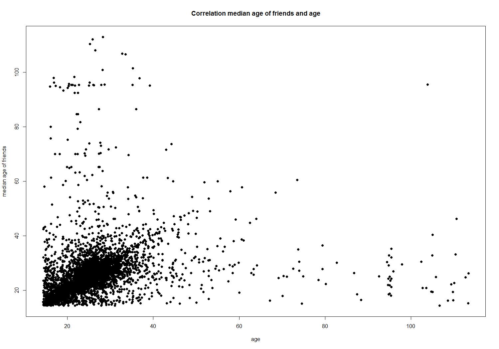
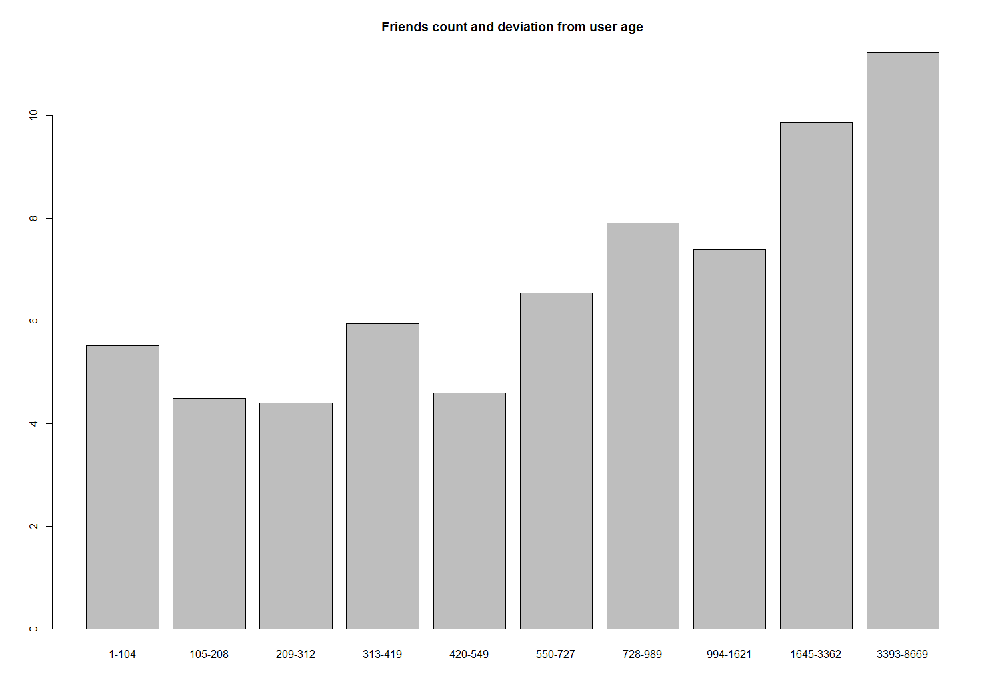
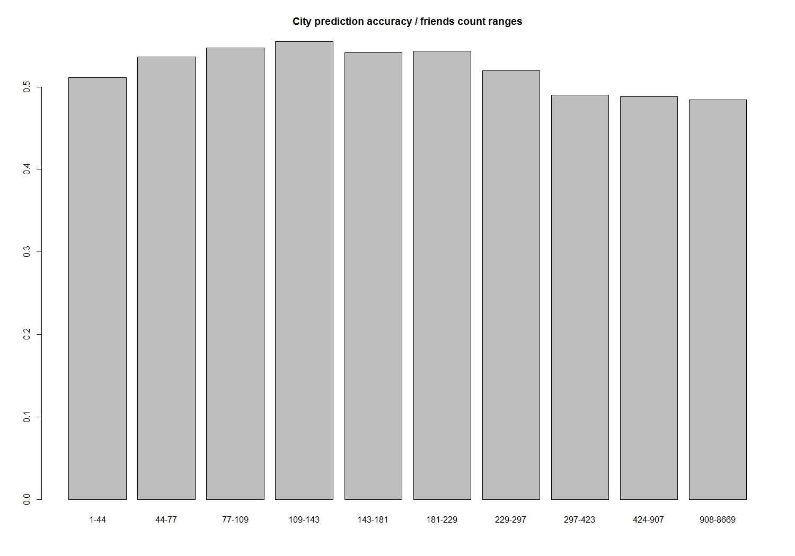

---
title: "Отчёт"
author: "Ivan R"
date: "May 20, 2015"
output: html_document
---

Стадия обработки данных
---
Запускаем скрипт из директории из которой видны adjacency_list и vertices.

Считываем вершины:
```
library(data.table)
library(eeptools)

setwd("vertices")
vFileNames <- list.files()
vFileNames <- vFileNames[file.size(vFileNames) != 0]
vDataTableList <- lapply(vFileNames, function(f) fread(f, sep=";", header=F, na.strings="", stringsAsFactors=F))
vertices <- rbindlist(vDataTableList)
setnames(vertices, colnames(vertices), c("id", "generation", "birthDates", "cities"))
```

Предпросчитываем дополнительную информацию (возраст каждого человека, год рождения (среднее в случае нескольких значений)), убираем ошибочные:
```
vertices$age <- sapply(vertices$birthDates, function(birthDate) getMeanAgeForDates(birthDate))
vertices$birthYear <- sapply(vertices$birthDates, function(birthDate) getMeanYearForDates(birthDate))

setwd("..")
```

Функции для обработки поля birthDates:
```
getMeanAgeForDates <- function(birthDates) {
  if (!is.na(birthDates)) {
    dateList <- lapply(strsplit(birthDates, "|", fixed = T),  as.Date)
    ageList <- sapply(dateList[[1]], 
                      function(date) 
                         if (format(date, "%Y") == "0000" | as.integer(format(date, "%Y")) > 2015) {
                           NA
                         } else {
	                        age_calc(date, units = "years")
                         }
    )   
    if (length(ageList[!is.na(ageList)]) > 0) mean(ageList, na.rm=T) else NA
  } else {
    NA
  }
}

getMeanYearForDates <- function(birthDates) {
  if (nchar(birthDates) > 0) {
    dateList <- lapply(strsplit(birthDates, "|", fixed = T),  as.Date)
    yearList <- sapply(dateList[[1]], 
                       function(date) 
                         if (format(date, "%Y") == "0000" | as.integer(format(date, "%Y")) > 2015) {
                           NA
                         } else {
                           as.integer(format(date, "%Y"))
                         }
    )   
    if (length(yearList[!is.na(yearList)]) > 0) mean(yearList, na.rm=T) else NA
  } else {
    NA
  }
}

```

Считываем рёбра:
```
setwd("adjacency_list")
eFileNames <- list.files()
eFileNames <- eFileNames[file.size(eFileNames) != 0]
eDataTableList <- lapply(eFileNames, function(f) fread(f, sep="S", stringsAsFactors=F))
edges <- rbindlist(eDataTableList)
setnames(edges, colnames(edges), c("id", "dst"))
```

Форматируем edges и добавляем их в таблицу vertices в соответствии с id:
```
edges$srcId <- sapply(edges$srcId, function(srcId) as.integer(substr(srcId, 2, nchar(srcId) - 1)))
edges$dst <- sapply(edges$dst, function(dst) as.integer(lapply(
                                  strsplit(substr(dst, 4, nchar(dst) - 2), ",")[[1]], as.integer)), USE.NAMES = F)

setwd("..")

vertices <- merge(vertices, edges, by="id", all.x=T)
setnames(vertices, "dst", "edges")
vertices$edges <- sapply(vertices$edges, function(edges) if (!is.null(edges[[1]])) edges else NA )
```

Очищаем память:
```
rm(edges)
rm(eDataTableList)
rm(vDataTableList)
rm(eFileNames)
rm(vFileNames)
```

1. Среднее количество друзей
---

Функция для рассчёта:
```
getFriendsCountMeanForGen <- function(gen = 0) {
  countsList <- sapply(vertices[generation == gen & !is.na(edges)]$edges, 
							function(edges) length(edges), simplify="array")
  sum(countsList, na.rm=T) / nrow(vertices[generation == gen])
}
```
**Результат:**

generation = 0 - 49.92471

generation = 1 - 347.0093


2. Возраст и дата рождения
---

**Как коррелирует возраст человека с возрастом его друзей? **

Очевидно, что в общем случае возраст человека коррелируется с возрастом его друзей, но в случае данной выборки это может быть не так.

Вычисляем средний возраст друзей каждого человека и рисуем график зависимости:
```
getFriendsAverageAge <- function(frindIds) {
	friendAges <- sapply(frindIds[[1]], function(friendId) vertices[id == friendId]$age[1])			  	
	result <- mean(friendAges, na.rm=T)
	if (!is.nan(result)) result else NA
}

drawAgeCorrelationChart <- function() {
	verticeSample <- vertices[(generation == 0 | generation == 1) & !is.na(age) & !is.na(edges)][order(age)]
	friendAverageAge <- sapply(verticeSample$edges, function(edges) getFriendsAverageAge(edges))
	result <- data.table(age = verticeSample$age, friendAverageAge = friendAverageAge)[!is.na(friendAverageAge)]
	plot(result$age, result$friendAverageAge, main="Correlation median age of friends and age", 
																xlab="age", ylab="median age of friends", pch=19)

	cor.test(result$age, result$friendAverageAge, method="pearson", alternative="g")
}
```



На графике просматривается слабая положительная связь.


Дополнительно посчитали коэффициент корреляции величин:

Коэффициент  корреляции Пирсона - 0.2292915

На графике видны сильные выбросы, что могло сильно повлиять на вличину коэффициента.


**Можно ли определить год рождения человека исходя из набора дат рождения его друзей?**

Существует возможность предсказать год рождения человека на основе дат рождения его друзей.

Например:

- Средний год рождения по всем друзьям

- Наиболее часто встречающийся год в датах рождения друзей


**С какой точностью?**

Рассчитываем для обоих случаев:


Средний год рождения по всем друзьям

```
getAverageBYear <- function(frindIds) {
	friendYears <- sapply(frindIds[[1]], function(friendId) vertices[id == friendId]$birthYear[1])
	result <- mean(friendYears, na.rm=T)
	if (!is.nan(result)) ceiling(result) else NA
}

getBirthYearPredictionAccuracyAvg <- function() {
	verticeSample <- vertices[(generation == 0 | generation == 1) & !is.na(age) & !is.na(edges)][order(age)]
	averageFriendsYears <- sapply(verticeSample$edges, function(edges) getAverageBYear(edges))
	comparisonTable <- data.table(userBYear = verticeSample$birthYear, friendBYear = averageFriendsYears)
                                                                                              [!is.na(friendBYear)]
	nrow(comparisonTable[userBYear == friendBYear]) / nrow(comparisonTable)
}
```
*Результат:*
Точность определения - 0.1847096


Наиболее часто встречающийся год в датах рождения друзей

```
getMostFrequentBYear <- function(frindIds) {
  friendYears <- sapply(frindIds[[1]], function(friendId) vertices[id == friendId]$birthYear[1])	
	counts <- sort(table(friendYears),decreasing=TRUE)[1]
	if (!is.na(counts)) {
		resultCount <- as.vector(counts)[1]
		result <- if (resultCount == 1) floor(mean(friendYears, na.rm=T)) else as.integer(names(counts)[1])
		result
	} else {
		NA
	}
}

getBirthYearPredictionAccuracyFreq <- function() {
	verticeSample <- vertices[(generation == 0 | generation == 1) & !is.na(age) & !is.na(edges)][order(age)]
	mostFrequentFriendsYear <- sapply(verticeSample$edges, function(edges) getMostFrequentBYear(edges))
	comparisonTable <- data.table(userBYear = verticeSample$birthYear, friendBYear = mostFrequentFriendsYear)
                                                                                              [!is.na(friendBYear)]
	nrow(comparisonTable[userBYear == friendBYear]) / nrow(comparisonTable)
}
```
*Результат:*
Точность определения - 0.1847096

В обоих случаях получили одинаковые результаты.


**Зависит ли точность от количества друзей / статистик возраста друзей?**

Построим график зависимости количтва друзей и уровня ошибки предсказанного результата (delta - разность между предсказанным результатом и правильным значением возраста)

```
verticeSample <- vertices[(generation == 0 | generation == 1) & !is.na(age) & !is.na(edges)][order(age)]
	averageFriendsYears <- sapply(verticeSample$edges, function(edges) getAverageBYear(edges))
	friendsCount <- sapply(verticeSample$edges, function(edges) length(edges))
	comparisonTable <- data.table(userBYear = verticeSample$birthYear, 
								  friendBYear = averageFriendsYears,
								  friendsCount = friendsCount)[!is.na(friendBYear)]
	comparisonTable$delta <- abs(comparisonTable$userBYear - comparisonTable$friendBYear)
	result <- comparisonTable[,list(delta=mean(delta)),by=friendsCount][order(friendsCount)]
	
	barCount <- 10
	rangeSize <- ceiling(nrow(result) / barCount)
	x <- sapply(split(result$friendsCount, ceiling(seq_along(result$friendsCount) / rangeSize)),
	            function(el) paste (as.character(head(el, 1)), as.character(tail(el, 1)), sep = "-"))
	
	y <- sapply(split(result$delta, ceiling(seq_along(result$delta) / rangeSize)), function(el) mean(el))
  
	barplot(y, main="Friends count and deviation from user age", names.arg=as.array(x))
```



Судя по графику - наблюдается обратная зависимость, 
т.е. при уменьшении числа друзей возрастает точность(уменьшается расхождение с правильным значением)


3. Предсказание города
---

Город проживания человека также можно определить по доступной информации о его друзьях с определённой точностью.
Аналогичный код для вычисления наиболее часто встречающегося города среди друзей человека

```
getMostFrequentCity <- function(frindIds) {
  friendCities <- sapply(frindIds[[1]], function(friendId) vertices[id == friendId]$cities[1])	
  counts <- sort(table(friendCities),decreasing=TRUE)[1]
  if (!is.na(counts)) {
    names(counts)[1]
  } else {
    NA
  }
}
```

Вычисление точности:

```
getCityPredictionAccuracy <- function() {
  verticeSample <- vertices[(generation == 0 | generation == 1) & !is.na(cities) & !is.na(edges)]
  mostFrequentFriendsCity <- sapply(verticeSample$edges, function(edges) getMostFrequentCity(edges))
  comparisonTable <- data.table(userCity = verticeSample$cities, friendCity = mostFrequentFriendsCity)[!is.na(friendCity)]
  nrow(comparisonTable[userCity == friendCity]) / nrow(comparisonTable)
}
```

*Результат:*
Точность определения - 0.521615


Для определения зависимости точности предсказания от количества друзей человека, нарисуем график

```
drawFriendsCountAndAccuracyRelationCity <- function() {
  verticeSample <- vertices[(generation == 0 | generation == 1) & !is.na(cities) & !is.na(edges)][order(age)]
  averageFriendsCity <- sapply(verticeSample$edges, function(edges) getMostFrequentCity(edges))
  friendsCount <- sapply(verticeSample$edges, function(edges) length(edges))
  comparisonTable <- data.table(userCity = verticeSample$cities, 
                                friendCity = averageFriendsCity,
                                friendsCount = friendsCount)[!is.na(friendCity)][order(friendsCount)]
  comparisonTable$prediction <- as.integer(comparisonTable$userCity == comparisonTable$friendCity)
  
  barCount <- 10
  x <- sapply(split(comparisonTable$friendsCount, ceiling(seq_along(comparisonTable$friendsCount) / barCount)),
              function(el) paste (as.character(head(el, 1)), as.character(tail(el, 1)), sep = "-"))
  
  y <- sapply(split(comparisonTable$prediction, ceiling(seq_along(comparisonTable$prediction) / barCount)),
              function(el) mean(el))
  
  barplot(y, main="City prediction accuracy / friends count ranges", names.arg=as.array(x))
}
```


По данному графику ничего определённого сказать нельзя.
В диапазоне количества друзей [1, 297] наблюдается небольшой рост точности определения города:
максимально на 5% в диапазоне [109, 143]


4. Метрика степени близости/силы дружбы.
---
В нашем случае есть всего 2 основных параметра которые могут быть использованы в вычислении схожести(силы дружбы) людей:

- возраст

- город проживания


Если не операться ни на какие статистические исследования, то субъективно можно предположить, что данные параметры
должны "хорошо" влиять на степень схожести.

Следовательно можно предложить формулу схожести(силы дружбы)(чем больше число, тем сильнее дружба):
K * 1 / |вораст ч. - возраст др.| + L * Int(город ч. == город др.)

Если находить степень схожести только для людей Gen == 0 и Gen == 1, то в метрику можно добавить ещё один параметр:

- количество общих друзей 


Метрика будет выглядеть так:

K * 1 / |вораст ч. - возраст др.| + L * Int(город ч. == город др.) + M * (количество общ. др.)


Коэффициенты K, L, M необходимо оптимизировать в зависимости от задачи которая будет решаться с помощью данной метрики.

Т.е. в различных задачах (или если появится дополнительная уточняющая информация) степень важности некоторых параметров может варьироваться.

По умолчанию для предоставленных данных или в качестве начального набора для оптимизации можно предложить следующие значения:

K = среднее отклонение возраста человека от возрастов его друзей

L = 1

M = среднее количество общих друзей


?эхэшх тюч№рёђр їхыютхър юђ тюч№рёђют хую ф№ѓчхщ

L = 1

M = ё№хфэхх ъюышїхёђтю юсљшѕ ф№ѓчхщ


